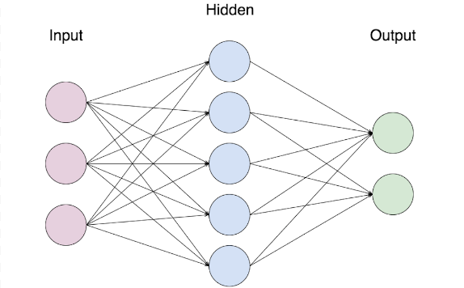

## Quick Start

In case that a problem arise to install the nltk-data, try this on a Python console:

``` python
import nltk
import ssl

try:
    _create_unverified_https_context = ssl._create_unverified_context
except AttributeError:
    pass
else:
    ssl._create_default_https_context = _create_unverified_https_context

nltk.download()

```
### Installation 

**first** clone the repository into your project.
One of the easiest ways to get started is to **run the docker image** :

```
docker image build -t chatbot .  
```

## How it works

Tokanize Words

```
                               NlP Preprocessing
                          "It is the application free?"
                                     |
                                     |           tokenize
                                     | 
                   [ "It", "is","the", "application", "free", "?" ]
                                     | 
                                     |           lower + steam
                                     | 
                   [ "it", "is","the", "app", "free", "?"  ]
                                     |
                                     |           exclude punctuation characters
                                     | 
                   [ "It", "is","the", "application", "free" ]
                                     |
                                     |           bag of words 
                                     | 
                    x    ===   [ 1, 1, 0, 1, 1, 1 ]
```

Bag of Words:

```
                                  
                                 Traning Data 
                                  all words
                             
                ["hi", "how", "are", "you", "bye", "see", "you", "later"]
                
       "hi"  -->[1, 0, 0, 0, 0, 0, 0, 0 ]                                           Tags
 "how are you"->[0, 1, 1, 1, 0, 0, 0, 0 ]                                      0 (Greeting)  
                
      "bye" --> [0, 0, 0, 0, 0, 1, 0, 0 ]
    "see you -->[0, 0, 0, 0, 1, 0, 1, 1 ]                                      1 (Goodbye)
      later"   
      
                            x                                                          y 
```

Model:




